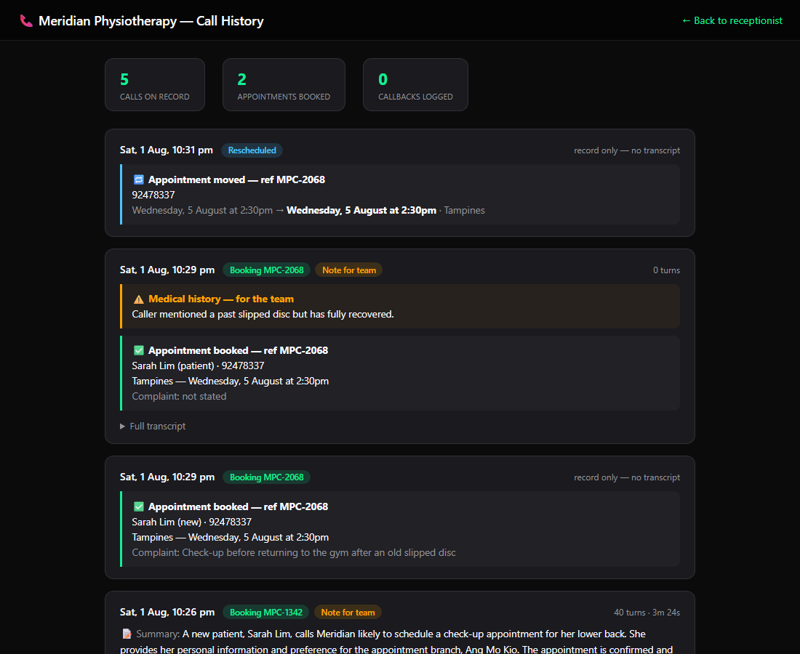

# Jane — AI Voice Receptionist for a Physiotherapy Clinic

A working phone receptionist for a Singapore physiotherapy clinic (a real clinic —
name fictionalized here as "Meridian Physiotherapy"), built on
**Deepgram's Voice Agent API** (Nova-3 STT · Aura-2 TTS · function calling), with
**Deepgram Text Intelligence** auto-summarizing every call for the owner's dashboard.

Built in three days on Deepgram's [node-voice-agent](https://github.com/deepgram-starters/node-voice-agent)
starter, using Claude Code. The point was to feel what Deepgram's buyers feel —
the friction I hit along the way is documented in [FRICTION-NOTES.md](FRICTION-NOTES.md).



## What Jane does

- **Books appointments** — collects patient details step by step, checks real slot
  availability via function calling (guardrail: *never invent a slot the calendar
  didn't return*), confirms with a booking reference read back letter by letter.
- **Reschedules and cancels** — looks up the caller's upcoming booking by mobile
  number; reschedules keep their reference.
- **Remembers returning patients** — a caller's number pulls their name, upcoming
  booking, and notes from previous calls, so Jane greets them by name and skips
  questions she already knows the answers to.
- **Triages emergencies safely** — current red-flag symptoms get calm advice to
  call 995 / go to A&E; *recovered* past conditions are treated as medical history,
  logged as a note for the clinic team, and never block a booking. Advice is given
  once — "you inform; the caller decides."
- **Loses no enquiry** — every call is logged with full transcript, duration,
  structured outcomes (booking / callback / cancellation / reschedule), silent
  notes for staff, and an auto-generated summary (Deepgram Text Intelligence).

## Stack

| Layer | Tech |
|---|---|
| Speech to text | Deepgram Nova-3 (streaming) |
| Voice | Deepgram Aura-2 (Thalia) |
| Reasoning | gpt-4o-mini via Deepgram-managed think provider |
| Call summaries | Deepgram Text Intelligence (`/v1/read?summarize=true`) |
| Backend | Node/Express WebSocket proxy, JWT session auth, JSONL call log |
| Frontend | Vanilla JS ([separate repo](https://github.com/Aloybuilds/physio-voice-agent-frontend), `frontend/` submodule) — branded call UI + owner dashboard |

## Run it locally

```bash
git clone --recurse-submodules https://github.com/Aloybuilds/physio-voice-agent.git
cd physio-voice-agent
pnpm install && cd frontend && pnpm install && cd ..
cp sample.env .env          # add your DEEPGRAM_API_KEY

node server.js              # API + proxy on :8081
cd frontend && npx vite     # demo UI on :8080
```

Talk to Jane at `http://localhost:8080` · owner dashboard at `http://localhost:8080/history.html`.

## End-to-end tests (against the live Deepgram Agent API)

Each script drives a full scripted conversation through the real proxy → live
Voice Agent API, with the same prompt and tools the demo ships. All three pass.

| Test | Proves |
|---|---|
| `scripts/e2e-booking-test.mjs` | Full booking flow: availability checked before any slot offered, correct booking args, reference issued and logged |
| `scripts/e2e-triage-test.mjs` | Regression for a real bug found in live testing: a caller with a *recovered* slipped disc was pushed toward emergency services three times. Now: zero false escalations, history note logged, booking completes |
| `scripts/e2e-returning-test.mjs` | Memory loop: known number → greeted by name → reschedule keeps the booking reference → record stored with digits-only mobile |

```bash
node server.js                          # in one terminal
node scripts/e2e-booking-test.mjs       # then run any test
```

## Developer friction log

[FRICTION-NOTES.md](FRICTION-NOTES.md) — five real DX issues hit while building,
each with root cause and suggested fix: SSH submodule URLs breaking fresh clones,
a 404'd docs link, choppy starter audio playback, a silent failure under Chrome's
autoplay policy, and proper-noun garbling in Text Intelligence summaries.

## License

MIT - See [LICENSE](./LICENSE) · Built on Deepgram's node-voice-agent starter.
